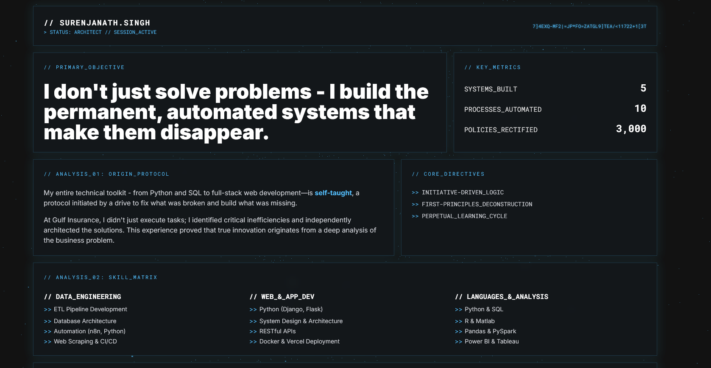

# Surenjanath Singh — Portfolio & Resume Site

Live: [https://surenjanath.github.io/](https://surenjanath.github.io/)

## Overview
This is the personal portfolio and resume site of Surenjanath Singh, Systems Architect. The site showcases my technical skills, project experience, and professional background, and provides a downloadable PDF resume. It is designed for clarity, modern aesthetics, and a strong technical impression.

## Features
- **Modern UI:** Built with custom CSS and Tailwind for a sleek, dark-themed look.
- **Animated Background:** Interactive Three.js particle system for visual depth.
- **Custom Cursor:** Futuristic reticle cursor for a unique user experience.
- **Downloadable Resume:** Prominent button to download the latest PDF resume.
- **Skills Matrix:** Clearly organized technical competencies and tools.
- **Project Highlights:** Summaries and links to key independent and professional projects.
- **Contact Panel:** Direct email and social links for easy communication.

## Structure
- `index.html` — Main site content and layout
- `assets/css/` — Stylesheets (Tailwind, custom, animations, etc.)
- `assets/js/` — JavaScript for interactivity and effects
- `resume/` — PDF and text versions of my resume
- `assets/image/` — (Add your screenshots here)

## Screenshots

### Main Page

## How to Use
1. Visit the site at [https://surenjanath.github.io/](https://surenjanath.github.io/)
2. Browse my background, skills, and projects.
3. Download my latest resume using the button in the header.
4. Use the contact panel to reach out via email or social links.

---
**Author:** Surenjanath Singh  
**Contact:** surenjanath.singh@gmail.com
